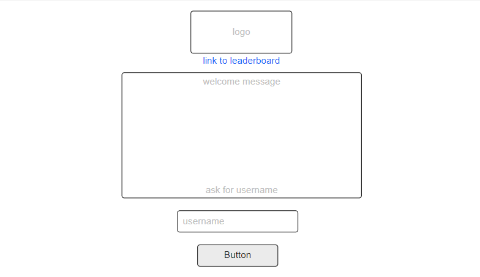
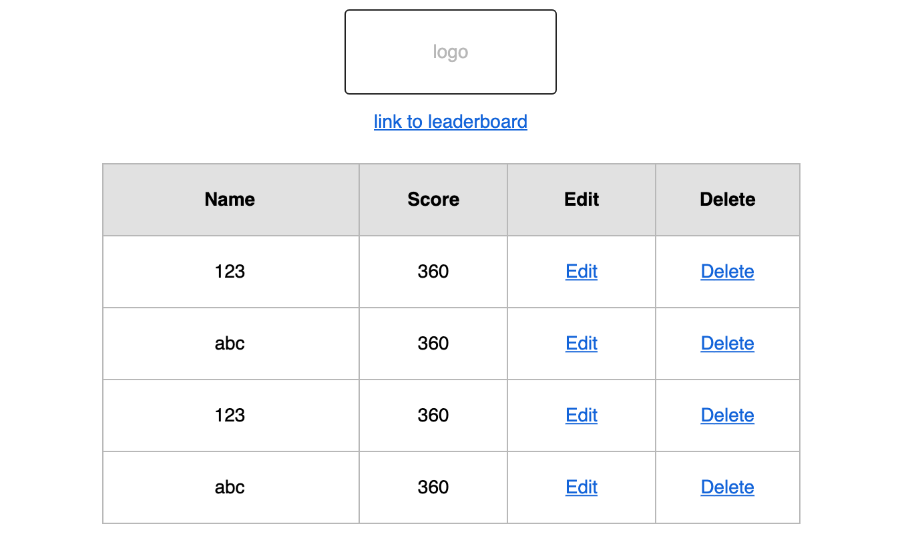

# Assignment 2 - Match The Monsters
### A tile matching game built with Vue

## Demo
Click 
[here](https://mabelsueh.github.io/trent-assignment-2-vue/)
to play!

To view the MongoDB repo, please click
[here](https://github.com/mabelsueh/trent-assignment-2).


## UI/UX

### Strategy

The objective of this website is to allow children, or adults if they'd like, to match identical tiles. It was made to be simple so that the game can be navigated intuitively and completed quickly an entertaining form of passing time. 

### User Goals
```
- As a user, I want to play a quick game without logging in, so I do not need to spend time recalling my username and password. 
- As a user, I want to see the high scores after the game has ended.
- As a user, I want to see visually pleasing graphics, so I can destress from my daily affairs. 

```

### Site Owner Goals
```
- As the site owner, I want to create a user-friendly game, so that it can be played intuitively. 
- As the site owner, I want to create a game that children can play easily, so that parents do not need to supervise them.
- As the site owner, I want to the website to be simple and easy to navigate, so that users have a good experience.
```

### Structure
The website is designed to be simple and intuitive to navigate, with minimal functions and routes. On the main page, users are prompted to key in their preferred username, and on submission they will be directed to the main game page where they can begin matching the monsters while seeing their score increase. When they finish matching the tiles, they will be alerted with a congratulatory message which displays the tallied score. 

Wireframe for the homepage (username input)<br>

<br>
Wireframe for the game page<br>
<br>
<br>
Wireframe for the leaderboard management page<br>


### Color & Font Choice
Upon suggestion from my classmates, I decided to use a child-friendly horror theme, 
for this site. I chose the yellowish font color as it complemented the black and blood red background. 
<br><br>
The font used is Creepster, and I chose to use it as it is decorative enough without being too over the top, and fits well with the cartoonish horror concept. 

## Features

1. Username input
2. Hidden Admin login page with redirect to leaderboard management, where they can delete scores
3. Leaderboard 

## Algorithms Used
1. 2D Array Traversal for the game board
2. Stack for checking if the tiles match
3. State Variables
4. Finite State Machine (still under construction)

## Technologies Used
- Front End Development: VueJS, CSS, Bootstrap, Bootstrap Vue and Google Fonts
- Functionality: VueJS and Javascript
- Coding Environment: Gitpod and Repl.it
- Database: MongoDB
- API Routing: Express
- Deployment: Github Pages and Heroku

## Testing
- Username input must be between 3 and 15 characters or a message will appear
- The tile at the same position cannot be selected twice and will not be considered a match. Nothing will happen if the user does so, and both tiles with the same image will remain. 

## Deployment
Deployment was taught to us by Paul of Trent Global College.

1. Deploy API to Heroku, a cloud application platform
2. Change all API routes to the new Heroku routes in VueJS repo
3. Deploy front end code to Github pages
4. Push all future updates to heroku and Github pages on top of the regular push

## Credits & Acknowledgements

I would like to thank the following people as this project would not have existed without them:

- Mr Paul Chor, Instructor at Trent Global College, for imparting his coding knowledge to us
- Mr Shun Ng, Teaching Assistant at Trent Global College, for clarifying my doubts from time to time
- My classmates at Trent Global College who helped me so so much with understanding and debugging code, as well as 
pushing and motivating me throughout this journey

Acknowledgements:
- [MikeBoStock](https://bost.ocks.org/mike/shuffle/) for the best explanation of the Fisher-Yates Shuffle
- [LogoMakr](https://logomakr.com/) for the game logo creation platform
- [Craftpix](https://craftpix.net/freebies/free-monster-2d-game-items/) for the monster images
- [xponentialdesign](https://giphy.com/gifs/blood-drip-f4IjBQupqojhqQzKk2/links)for the background gif


